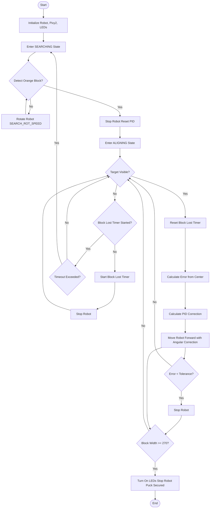
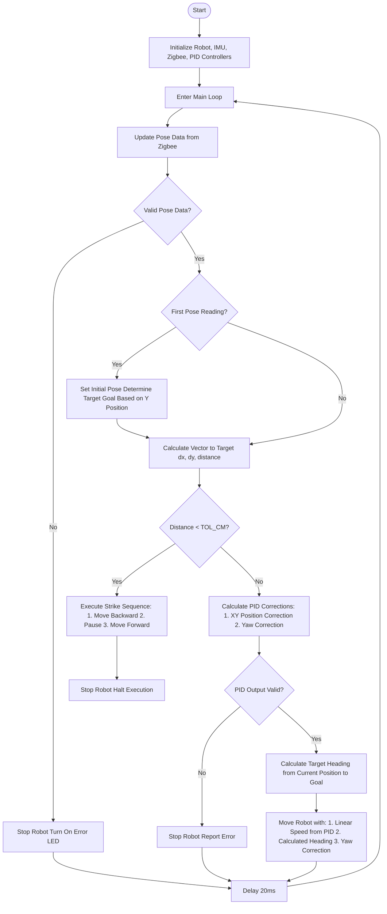
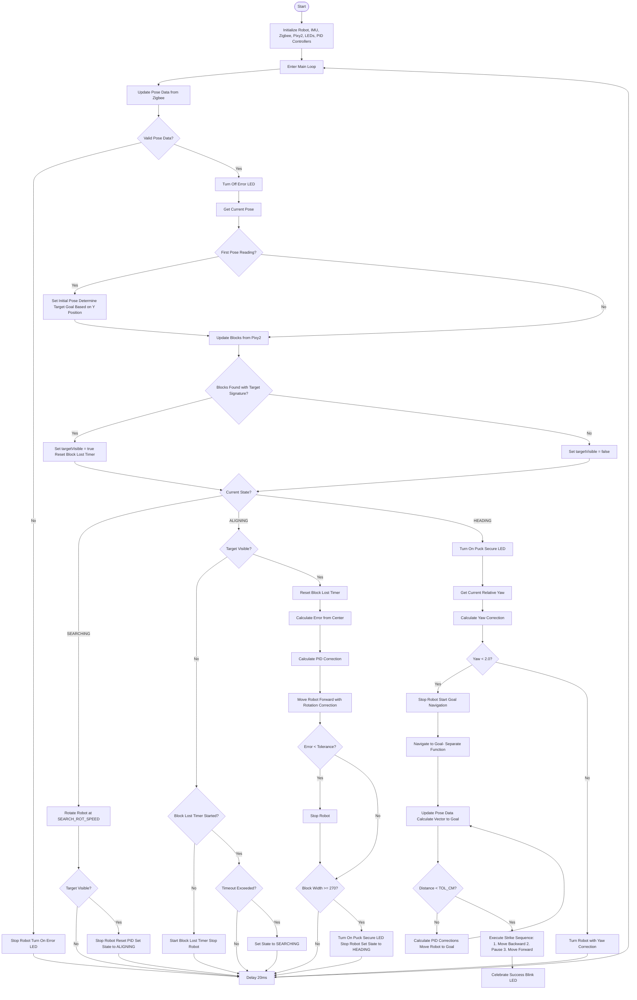

# Robo Hockey Control System

This directory contains Arduino codes for a robot designed to play hockey. The system uses a three-wheel omni-directional robot with a triangular wheel configuration, equipped with various sensors including Pixy2 camera for puck detection, IMU for orientation tracking, and Zigbee/Aruco for positioning.

## Table of Contents

- [Project Overview](#project-overview)
- [System Requirements](#system-requirements)
- [Code Structure](#code-structure)
- [TrackNSecurePuck](#tracknsecurepuck)
- [GoToGoal](#gotogoal)
- [StateMachine](#statemachine)
- [Hardware Configuration](#hardware-configuration)
- [PID Controllers](#pid-controllers)
- [Troubleshooting](#troubleshooting)

## Project Overview

The Robo Hockey system consists of three main test components:

1. **TrackNSecurePuck**: Locates and secures a hockey puck using a Pixy2 camera
2. **GoToGoal**: Navigates to a goal position using a positioning system
3. **StateMachine**: Combines puck tracking and goal navigation in a complete state machine

These components can be used independently or together to create a complete hockey-playing robot capable of finding pucks, securing them, and navigating to a goal position to score.

## System Requirements

### Libraries

- `PIDController`: For motion control and stabilization
- `SensorSuite`: For sensor integration (Pixy2, IMU, Ultrasonic, Zigbee/Aruco)
- `RobotBase`: For controlling the three-wheel omni-directional robot

### Hardware

- Arduino Mega or compatible board
- Three-wheel omni-directional robot with triangular wheel configuration
- Pixy2 camera for puck detection
- BNO055 9-DOF IMU for orientation sensing
- Zigbee module for communication with an external positioning system
- Status LEDs (red LED and puck secure LED)

## Code Structure

```
Arduino Codes
├── GoToGoal
│   └── GoToGoal.ino         # Goal navigation using position tracking
├── StateMachine
│   └── StateMachine.ino     # Complete state machine for hockey playing
└── TrackNSecurePuck
    └── TrackNSecurePuck.ino # Puck tracking and securing
```

## TrackNSecurePuck

TrackNSecurePuck focuses on finding and securing a hockey puck using a Pixy2 camera.

### Operational Logic



### Pseudocode

```
INITIALIZE:
    Set up Serial communication
    Initialize robot base
    Initialize Pixy2 camera
    Set up LED pins
    Set current state to SEARCHING

MAIN LOOP:
    Get current time
    Update blocks data from Pixy2

    IF blocks found AND largest block has signature ORANGE_SIG THEN
        Set targetVisible = true
        Reset blockLostStartTime
    ELSE
        Set targetVisible = false
    END IF

    SWITCH currentState:
        CASE SEARCHING:
            Rotate robot at SEARCH_ROT_SPEED
            IF targetVisible THEN
                Stop robot
                Reset PID controller
                Set currentState to ALIGNING
                Reset alignStableStartTime
            END IF

        CASE ALIGNING:
            IF NOT targetVisible THEN
                IF blockLostStartTime is 0 THEN
                    Set blockLostStartTime to current time
                    Stop robot
                ELSE IF (current time - blockLostStartTime) > BLOCK_LOST_TIMEOUT_MS THEN
                    Set currentState to SEARCHING
                END IF
            ELSE
                Reset blockLostStartTime

                Calculate error from center of frame
                Calculate rotational correction using PID

                Move robot forward with rotational correction

                IF absolute error < PIXEL_TOLERANCE THEN
                    Stop robot
                END IF

                IF block width >= 270 THEN
                    Turn on LEDs
                    Stop robot
                    Halt program (puck secured)
                ELSE
                    Turn off LEDs
                END IF
            END IF
    END SWITCH

    Delay 20ms
```

### Key Parameters

- `ORANGE_SIG = 1`: Pixy2 signature for the orange puck
- `SEARCH_ROT_SPEED = 195.0`: Rotation speed during search
- `MAX_ALIGN_ROT_SPEED = 1.0`: Maximum rotation speed during alignment
- `PIXEL_TOLERANCE = 2`: Pixel error tolerance for centering
- `BLOCK_LOST_TIMEOUT_MS = 1000`: Timeout before returning to search state
- PID values: `Kp = 4`, `Ki = 0.01`, `Kd = 0.05`

## GoToGoal

GoToGoal navigates to a predefined goal position using Zigbee/Aruco for position tracking and an IMU for orientation control.

### Operational Logic



### Pseudocode

```
INITIALIZE:
    Set up Serial communication
    Initialize Zigbee serial port
    Initialize robot base
    Initialize Zigbee handler
    Initialize IMU
    Reset IMU yaw
    Initialize LED pin

MAIN LOOP:
    Get current time
    Update pose data from Zigbee

    IF Zigbee has valid pose THEN
        Turn off error LED
        Get current pose

        IF not initialPose THEN
            Set initialPose = true

            IF currentPose.y > 120 THEN
                Set headingOffset = 180.0
                Set TARGET_X = GOAL_X1
                Set TARGET_Y = GOAL_Y1
            ELSE
                Use default TARGET_X = GOAL_X2, TARGET_Y = GOAL_Y2
            END IF
        END IF

        Calculate dx = TARGET_X - currentPose.x
        Calculate dy = TARGET_Y - currentPose.y
        Calculate distanceToTarget = sqrt(dx² + dy²)

        IF distanceToTarget < TOL_CM THEN
            Stop robot
            Move backward for strike
            Delay 1500ms
            Stop robot
            Delay 500ms
            Move forward for strike
            Delay 2000ms
            Stop robot
            Halt execution (loop)
        ELSE
            Calculate XY PID corrections using pidXY controller

            IF calculatedLinSpeed is NaN THEN
                Report error and stop
                Return
            END IF

            Get current relative yaw from IMU
            IF yaw reading valid THEN
                Calculate yaw correction using straightLineYaw controller
            ELSE
                Report warning
            END IF

            Calculate target angle to goal
            Move robot with calculated speed, heading, and yaw correction
        END IF
    ELSE
        Stop robot
        Turn on error LED
    END IF

    Delay 20ms
```

### Key Parameters

- Goal positions:
  - Goal 1: `GOAL_X1 = 55`, `GOAL_Y1 = 30`
  - Goal 2: `GOAL_X2 = 55`, `GOAL_Y2 = 210`
- `TOL_CM = 2.0`: Target tolerance in centimeters
- `MAX_ANGULAR_CORRECTION = 1.0`: Maximum angular correction scaling
- `MAX_LINEAR_SPEED = 180.0`: Maximum linear speed
- XY PID values: `Kp = 15`, `Ki = 0.01`, `Kd = 0.15`
- Yaw PID values: `Kp = -16`, `Ki = 0.1`, `Kd = 0.5`

## StateMachine

StateMachine combines puck tracking and goal navigation into a complete state machine for hockey playing.

### Operational Logic



### Pseudocode

```
INITIALIZE:
    Set up Serial communication
    Initialize Zigbee serial port
    Initialize robot base
    Initialize Zigbee handler
    Initialize IMU
    Reset IMU yaw
    Initialize Pixy2 camera
    Set up LED pins
    Set current state to SEARCHING

MAIN LOOP:
    Get current time
    Update pose data from Zigbee

    IF NOT Zigbee has valid pose THEN
        Stop robot
        Turn on error LED
        Return (skip iteration)
    END IF

    Turn off error LED
    Get current pose

    IF NOT initialPose THEN
        Set initialPose = true

        IF currentPose.y > 120 THEN
            Set headingOffset = 180.0
            Set TARGET_X = GOAL_X1
            Set TARGET_Y = GOAL_Y1
        ELSE
            Use default values
        END IF
    END IF

    Update blocks from Pixy2
    IF blocks found AND largest block has signature ORANGE_SIG THEN
        Set targetVisible = true
        Reset blockLostStartTime
    ELSE
        Set targetVisible = false
    END IF

    SWITCH currentState:
        CASE SEARCHING:
            Rotate robot at SEARCH_ROT_SPEED
            IF targetVisible THEN
                Stop robot
                Reset PID controller
                Set currentState to ALIGNING
                Reset alignStableStartTime
                Delay briefly
            END IF

        CASE ALIGNING:
            IF NOT targetVisible THEN
                IF blockLostStartTime is 0 THEN
                    Set blockLostStartTime to current time
                    Stop robot
                ELSE IF (current time - blockLostStartTime) > BLOCK_LOST_TIMEOUT_MS THEN
                    Set currentState to SEARCHING
                END IF
            ELSE
                Reset blockLostStartTime

                Calculate error from center of frame
                Calculate rotational correction using PID

                Move robot forward with rotational correction

                IF absolute error < PIXEL_TOLERANCE THEN
                    Stop robot
                END IF

                IF block width >= 270 THEN
                    Turn on puck secure LED
                    Stop robot
                    Set currentState to HEADING
                END IF
            END IF

        CASE HEADING:
            Turn on puck secure LED
            Get current relative yaw from IMU

            IF yaw is valid THEN
                Calculate yaw correction using PID
                Constrain correction

                IF absolute yaw < 2.0 THEN
                    Stop robot
                    Start goal navigation (call startGoal function)
                ELSE
                    Move robot with yaw correction to straighten
                END IF
            END IF
    END SWITCH

    Delay 20ms

FUNCTION startGoal:
    LOOP forever:
        Update pose data from Zigbee
        IF NOT valid pose THEN
            Report error
            Turn on error LED
            Stop robot
            Continue to next iteration
        END IF

        Turn off error LED
        Get current pose

        Calculate vector to target (dx, dy, distance)

        IF distance < TOL_CM THEN
            Stop robot
            Execute strike sequence:
              1. Move backward
              2. Pause
              3. Move forward with higher speed
              4. Stop
            Celebrate with LED blinking
            Halt execution (loop)
        ELSE
            Calculate PID corrections for navigation
            Apply corrections to robot motion
        END IF

        Delay 20ms
    END LOOP
```

### Key Parameters

- Goal positions (same as GoToGoal)
- Block detection parameters (same as TrackNSecurePuck)
- PID controllers:
  - Block centering: `Kp = 4`, `Ki = 0.01`, `Kd = 0.05`
  - XY navigation: `Kp = 15`, `Ki = 0.01`, `Kd = 0.15`
  - Yaw control: `Kp = -16`, `Ki = 0.1`, `Kd = 0.5`
- State machine timeouts: `ALIGN_STABLE_MS = 3000`, `BLOCK_LOST_TIMEOUT_MS = 5000`

## Hardware Configuration

### Robot Base

The robot uses a three-wheel omni-directional platform with wheels arranged in a triangular configuration:

```
Pin Configuration:
- PWM pins: {4, 5, 6}
- Direction pins: {49, 47, 45}
- Reverse flags: {true, false, true}
```

### Sensors

1. **IMU (BNO055)**:
   - Provides absolute and relative orientation data
   - Used for maintaining heading during navigation

2. **Pixy2 Camera**:
   - Detects colored objects (orange puck)
   - Frame dimensions: 316x208 pixels
   - Configured to track signature 1 (orange)

3. **Zigbee/Aruco System**:
   - Connected to Serial1 (pins 19/18) at 115200 baud
   - Provides XY position data from an external tracking system
   - LED on pin 37 indicates valid position data

### LEDs

- **Puck Secure LED**: Pin 35 - Indicates when a puck is securely captured
- **Red LED**: Pin 37 - Indicates errors or status

## PID Controllers

The system uses three separate PID controllers:

1. **XY Position Controller**:
   - Controls robot movement toward goal coordinates
   - Gains: `Kp = 15`, `Ki = 0.01`, `Kd = 0.15`
   - Accumulation factors: Present = 1.0, Past = 0.98

2. **Yaw Controller**:
   - Maintains robot orientation during movement
   - Gains: `Kp = -16`, `Ki = 0.1`, `Kd = 0.5`
   - Standard accumulation factors

3. **Block Orientation Controller**:
   - Centers the robot on the detected puck
   - Gains: `Kp = 4`, `Ki = 0.01`, `Kd = 0.05`
   - Accumulation factors: Present = 1.0, Past = 0.99

## Troubleshooting

### Common Issues

1. **Robot spins continuously in SEARCHING state**:
   - Check Pixy2 camera connection
   - Verify ORANGE_SIG matches the signature programmed in PixyMon
   - Ensure the puck color is properly recognized

2. **Robot fails to navigate to goal**:
   - Check Zigbee communication (Serial1 connection)
   - Verify the Aruco markers are properly recognized by the external system
   - Check IMU calibration and orientation

3. **PID calculation results in NaN**:
   - This usually indicates invalid inputs or unstable gains
   - Review PID parameters and reset integral accumulator

4. **Red LED stays on**:
   - Indicates position tracking failure
   - Check Zigbee module and external tracking system

5. **Robot oscillates or overshoots target**:
   - Tune PID gains (especially decrease Kp or increase Kd)
   - Adjust MAX_LINEAR_SPEED or MAX_ANGULAR_CORRECTION

For more detailed information about the libraries used in this project, refer to their documentation:

- [PIDController Library](../libraries/PIDController/README.md): Provides robust PID control algorithms
- [SensorSuite Library](../libraries/SensorSuite/README.md): Interfaces with sensors used in robotics applications
- [RobotBase Library](../libraries/RobotBase/README.md): Controls a 3-wheel omni-directional robot
