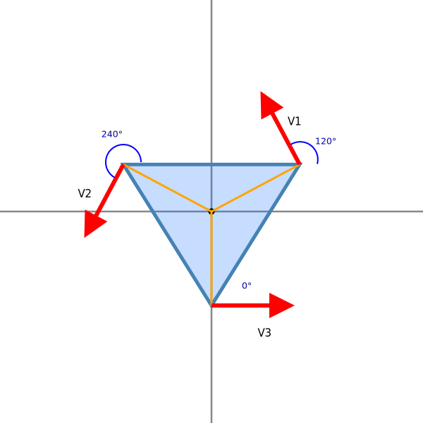

# RobotBase

An Arduino library for controlling a 3-wheel omni-directional robot with triangular wheel configuration.

## Table of Contents

- [Overview](#overview)
- [Installation](#installation)
- [Mathematical Model](#mathematical-model)
  - [Wheel Configuration](#wheel-configuration)
  - [Forward Kinematics](#forward-kinematics)
  - [Inverse Kinematics](#inverse-kinematics)
- [Usage](#usage)
  - [Basic Setup](#basic-setup)
  - [Moving the Robot](#moving-the-robot)
  - [Example Code](#example-code)
- [API Reference](#api-reference)
  - [Constructors](#constructors)
  - [Methods](#methods)
  - [Constants](#constants)
- [Repository Structure](#repository-structure)

## Overview

RobotBase provides a simple and powerful interface for controlling a three-wheel omni-directional robot. The library handles the complex inverse kinematics calculations needed to convert desired robot movement (direction, speed, and rotation) into individual motor commands. It's designed for robots with three omni wheels arranged in a triangular configuration, with wheels placed at 60°, -60°, and 180° from the forward direction.

## Installation

1. Download the library as a ZIP file
2. In the Arduino IDE, go to Sketch > Include Library > Add .ZIP Library...
3. Select the downloaded ZIP file
4. After installation, examples can be found in File > Examples > RobotBase

## Mathematical Model

### Wheel Configuration

The robot base consists of three omni wheels arranged symmetrically around a central point, with the following configuration:



Where:

- Wheel 1 (Motor 0): positioned at +60° from forward direction (Front-Right)
- Wheel 2 (Motor 1): positioned at -60° from forward direction (Front-Left)
- Wheel 3 (Motor 2): positioned at 180° from forward direction (Rear)

The coordinate system is:

- +Y: Forward
- +X: Right
- Angular rotation: Counter-clockwise positive

### Forward Kinematics

Forward kinematics calculates the robot's overall motion from individual wheel velocities.

Given wheel velocities v₁, v₂, and v₃, the robot's motion can be calculated as:

The contribution of each wheel to the robot's motion is:

For wheel 1:
$$v1_x = -v1 \cdot \cos(60°) = -0.5 \cdot v1$$
$$v1_y = v1 \cdot \sin(60°) = 0.866 \cdot v1$$

For wheel 2:
$$v2_x = -v2 \cdot \cos(60°) = -0.5 \cdot v2$$
$$v2_y = -v2 \cdot \sin(60°) = -0.866 \cdot v2$$

For wheel 3:
$$v3_x = v3$$
$$v3_y = 0$$

The robot's linear velocity components are:
$$v_x = v1_x + v2_x + v3_x = -0.5v1 - 0.5v2 + v3$$
$$v_y = v1_y + v2_y + v3_y = 0.866v1 - 0.866v2$$

And the angular velocity is:
$$\omega = v1 + v2 + v3$$

In matrix form:

$$
\begin{bmatrix}
v_x \\
v_y \\
\omega
\end{bmatrix}
=
\begin{bmatrix}
-0.5 & -0.5 & 1 \\
\frac{\sqrt{3}}{2} & -\frac{\sqrt{3}}{2} & 0 \\
1 & 1 & 1
\end{bmatrix}
\begin{bmatrix}
v1 \\
v2 \\
v3
\end{bmatrix}
$$

### Inverse Kinematics

Inverse kinematics calculates the required wheel velocities to achieve a desired robot motion.

Given the desired robot velocity components (v_x, v_y) and angular velocity (ω), the required wheel velocities are:

$$
\begin{bmatrix}
v1 \\
v2 \\
v3
\end{bmatrix}
=
\frac{1}{3}
\begin{bmatrix}
-1 & \sqrt{3} & 1 \\
-1 & -\sqrt{3} & 1 \\
2 & 0 & 1
\end{bmatrix}
\begin{bmatrix}
v_x \\
v_y \\
\omega
\end{bmatrix}
$$

Which expands to:

$$v1 = \frac{1}{3}(-v_x + \sqrt{3}v_y + \omega)$$
$$v2 = \frac{1}{3}(-v_x - \sqrt{3}v_y + \omega)$$
$$v3 = \frac{1}{3}(2v_x + \omega)$$

These equations are implemented in the `moveRobot()` method, where:

- v_x = linearSpeed * sin(thetaRad)
- v_y = linearSpeed * cos(thetaRad)
- omega = angularSpeed

## Usage

### Basic Setup

```cpp
#include <RobotBase.h>

// Method 1: Using default pin configuration
RobotBase robot;

// Method 2: Using custom pin configuration
int pwmPins[3] = {4, 5, 6};         // PWM pins for motors
int dirPins[3] = {49, 47, 45};      // Direction pins for motors
bool reverseFlags[3] = {true, false, true}; // Motor direction inversion flags
RobotBase robot(pwmPins, dirPins, reverseFlags);

void setup() {
  // Initialize the robot (sets up pin modes)
  robot.begin();
}
```

### Moving the Robot

```cpp
// Move forward
robot.moveRobot(100, 0, 0);  // linearSpeed=100, direction=0° (forward), angularSpeed=0

// Move backward
robot.moveRobot(100, 180, 0);  // linearSpeed=100, direction=180° (backward), angularSpeed=0

// Move right
robot.moveRobot(100, 90, 0);  // linearSpeed=100, direction=90° (right), angularSpeed=0

// Move left
robot.moveRobot(100, 270, 0);  // linearSpeed=100, direction=270° (left), angularSpeed=0

// Move diagonally (forward-right)
robot.moveRobot(100, 45, 0);  // linearSpeed=100, direction=45° (forward-right), angularSpeed=0

// Rotate clockwise (without translation)
robot.moveRobot(0, 0, -50);  // linearSpeed=0, direction=0° (irrelevant), angularSpeed=-50

// Rotate counter-clockwise (without translation)
robot.moveRobot(0, 0, 50);  // linearSpeed=0, direction=0° (irrelevant), angularSpeed=50

// Move and rotate simultaneously
robot.moveRobot(100, 30, 50);  // linearSpeed=100, direction=30°, angularSpeed=50

// Stop all motors
robot.stop();
```

### Example Code

The library includes a `BasicDrive` example that demonstrates basic functionality:

```cpp
#include <RobotBase.h>

// Define pin configurations
int pwmPins[3] = {4, 5, 6};
int dirPins[3] = {49, 47, 45};
bool reverseFlags[3] = {true, false, true};
RobotBase robot(pwmPins, dirPins, reverseFlags);

void setup() {
  Serial.begin(115200);
  robot.begin();

  // Optional: Test each motor individually
  for (int i = 0; i < 3; i++) {
    robot.testMotor(i);
  }

  Serial.println("Robot ready!");
}

void loop() {
  // Process serial commands to control the robot
  // Format: P<linear_speed>W<angular_speed>A<angle_degrees>M<delay_ms/100>K
  // Example: P100W50A30M10K (Speed 100, Angular 50, Angle 30°, Delay 1000ms)

  // See the BasicDrive example for full implementation details
}
```

The example accepts commands over Serial in the format `P<linear_speed>W<angular_speed>A<angle_degrees>M<delay_ms/100>K`:

- `P`: Sets the linear speed (magnitude)
- `W`: Sets the angular speed (CCW positive)
- `A`: Sets the movement direction angle in degrees (clockwise from forward)
- `M`: Sets a delay in 100ms units, after which the robot will stop
- `K`: Executes the movement command or stops immediately if sent alone

Example command: `P100W50A30M10K` - Move with linearSpeed=100, angularSpeed=50, angle=30°, delay=1000ms

## API Reference

### Constructors

```cpp
// Constructor with custom pin configuration
RobotBase(const int pwmPins[3], const int dirPins[3], const bool reverse[3]);

// Default constructor (uses default pin configuration)
RobotBase();
```

### Methods

```cpp
// Initialize pins (call in setup())
void begin();

// Move robot with specified linear speed, direction, and angular speed
void moveRobot(double linearSpeed, double thetaDeg, double angularSpeed);

// Stop all motors immediately
void stop();

// Change motor pin configuration after initialization
void setMotorPins(const int pwmPins[3], const int dirPins[3], const bool reverse[3]);

// Test a specific motor
void testMotor(int motorIndex);
```

#### moveRobot Parameters

- `linearSpeed`: Magnitude of linear velocity (0-255)
- `thetaDeg`: Direction angle in degrees, clockwise from forward:
  - 0° = Forward
  - 90° = Right
  - 180° = Backward
  - 270° = Left
- `angularSpeed`: Magnitude of rotational velocity (positive = CCW, negative = CW)

### Constants

```cpp
// Default pin configurations
static constexpr int DEFAULT_PWM_PINS[3] = {4, 5, 6};
static constexpr int DEFAULT_DIR_PINS[3] = {49, 47, 45};
static constexpr bool DEFAULT_REVERSE_FLAGS[3] = {false, false, false};

// Maximum PWM value
static constexpr int MAX_PWM = 255;
```

## Repository Structure

- **RobotBase.h**: Header file containing class declaration and documentation
- **RobotBase.cpp**: Implementation file with method definitions
- **examples/BasicDrive/BasicDrive.ino**: Example sketch demonstrating basic usage
- **keywords.txt**: Keywords for syntax highlighting in Arduino IDE
- **library.properties**: Library metadata for Arduino Library Manager
